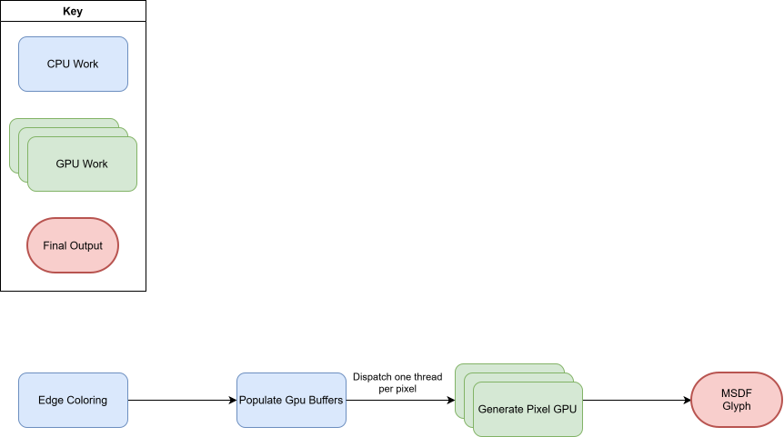

# GPU Based Multi-Signed Distance Field Generation for Font Glyphs
Chlumsky's thesis introduces several methods for generating distance fields for font rendering. We'll be focusing on the two algorithms used in generating multi signed distance fields: edge coloring and the pixel generation algorithm.

## Edge Coloring
Edge coloring would be overly complex to parallelize itself, so the algorithm will not be modified and will be ran in serial when generating individual glyphs. However, the algorithm will be ran in parallel when generating a font sheet. A implementation of this algorithm in pseudo c++ can be seen below:
```c++
struct Edge 
{
    float3 color;
}

struct Contour 
{
    uint numEdges;
    Edge edges[]
};

struct Shape 
{
    uint numContours
    Contour contours[];
};

void EdgeColoring(Shape s) 
{
    float3 color;
    for (int ci = 0; ci < s.numContours; ci++)
    {
        Contour c = s.contours[ci];
        if (c.numEdges == 1) 
        {
            color = float3(1, 1, 1);
        }
        else 
        {
            color = float3(1, 0, 1);
        }
        for (ei = 0; ei < c.numEdges; ei++)
        {
            Edge e = c.edges[ei];
            e.color = color;
            if (color == float3(1, 1, 0))
            {
                color = float3(0, 1, 1);
            } 
            else 
            {
                color = float3(1, 1, 0);
            }
        }
    }

    return color;
}
```

## Pixel Generation Algorithm

The pseudo C++ implementation of the pixel generation algorithm can be seen below: 
```c++
float3 GeneratePixel(float2 P) 
{
    float dRed = inf;
    float dGreen = inf;
    float dBlue = inf;
    Edge eRed, eGreen, eBlue;

    for (int ci = 0; ci < s.numContours; ci++)
    {
        for (ei = 0; ei < c.numEdges; ei++)
        {
            Edge e = c.edges[ei];
            float d = EdgeSignedDistance(P, e);
            if e.color.r != 0 && CMP(d, dRed) < 0
            {
                dRed = d;
                eRed = e;
            }
            if e.color.g != 0 && CMP(d, dGreen) < 0
            {
                dGreen = d;
                eGreen = e;
            }
            if e.color.b != 0 && CMP(d, dBlue) < 0
            {
                dBlue = d;
                eBlue = e;
            }
        }
    }
    dRed = EdgeSignedPseudoDistance(P, eRed);
    dGreen = EdgeSignedPseudoDistance(P, eGreen);
    dBlue = EdgeSignedPseudoDistance(P, eBlue);
    return distanceColor(float3(dRed, dGreen, dBlue));
}
```

Unlike the prior algorithm described, this algorithm can be easily parallelized. Thanks to the fact that the edges of the glyph can be evaluated independently. However, there are some challenges present that must be accounted for. First, HLSL shader model 5.0 lack support for virtual inheritance, so we can't rely on virtual dispatch to handle evaluating the right functions on the varying orders of bezier curves. This can be overcome by splitting the bezier curves into their own structs as seen below:
```c++
struct LinearBezier 
{
    uint color;
    float2 p0;
    float2 p1;
};

struct QuadraticBezier 
{
    uint color;
    float2 p0;
    float2 p1;
    float2 p2;
};

struct CubicBezier 
{
    uint color;
    float2 p0;
    float2 p1;
    float2 p2;
    float2 p3;
};
```

Then, rather than having a heterogeneous buffer containing all of the bezier curves, we will split them into three homogeneous buffers as seen below:

```c++
StructuredBuffer<LinearBezier> linearEdges;
StructuredBuffer<QuadraticBezier> quadraticEdges;
StructuredBuffer<CubicBezier> cubicEdges;
```

The code for updating the distance and output color will be pulled out into a sharable function:

```c++
struct EdgeColors 
{
    float3 red; 
    float3 green; 
    float3 blue;
};

void UpdateDistances(float d, float3 edgeColor, inout float3 distances, 
    out Edges outEdgeColors) 
{
    if edgeColor.r != 0 && CMP(d, distances.r) < 0
    {
        distances.r = d;
        outEdgeColors.red = edgeColor;
    }
    if edgeColor.g != 0 && CMP(d, distances.g) < 0
    {
        distances.g = d;
        outEdgeColors.green = edgeColor;
    }
    if edgeColor.b != 0 && CMP(d, distances.b) < 0
    {
        distances.b = d;
        outEdgeColors.blue = edgeColor;
    }
}
```

Finally, our version of `GeneratePixel()` looks like the following:

```c++
float3 GeneratePixelGPU(float2 P) 
{
    float3 linearDistances = {0, 0, 0};
    EdgeColors linearEdgeColors = {};
    float3 quadraticDistances = {0, 0, 0};
    EdgeColors   quadraticEdgeColors = {};
    float3 cubicDistances = {0, 0, 0};
    EdgeColors   cubicEdgeColors = {};

    for (int i = 0; i < linearEdges.size(); i++) 
    {
        LinearBezier edge = linearEdges[i];
        float3 edgeColor = UnpackColor(edge.color);
        float d = LinearEdgeSignedDistance(P, edge);
        UpdateDistances(d, edgeColor, linearDistances, linearEdgeColors);
        edge.color = PackColor(edgeColor);
    }

    for (int i = 0; i < quadraticEdges.size(); i++) 
    {
        quadraticBezier edge = quadraticEdges[i];
        float3 edgeColor = UnpackColor(edge.color);
        float d = QuadraticEdgeSignedDistance(P, edge);
        UpdateDistances(d, edgeColor, QuadraticDistances, QuadraticEdgeColors);
        edge.color = PackColor(edgeColor);
    }

    for (int i = 0; i < CubicEdges.size(); i++) 
    {
        CubicBezier edge = CubicEdges[i];
        float3 edgeColor = UnpackColor(edge.color);
        float d = CubicEdgeSignedDistance(P, edge);
        UpdateDistances(d, edgeColor, CubicDistances, CubicEdgeColors);
        edge.color = PackColor(edgeColor);
    }

    float3 closestDistances = {};

    GetFinalValues(
        linearDistances,
        linearEdgeColors,
        quadraticDistances,
        quadraticEdgeColors,
        cubicDistances,
        cubicEdgeColor,
        closestDistances,
    );

    float3 colors = EdgeSignedPseudoDistance(P, closestDistances);
    return distanceColor(colors);
}
```

Where `LinearEdgeSignedDistance()`, `QuadraticEdgeSignedDistance()`, and `CubicEdgeSignedDistance()` calculate the edge signed distance for the specified order of bezier curve and `GetFinalValues()` selects the final distance values that are passed to `EdgeSignedPseudoDistance()`. We can then use this version of the algorithm in a compute dispatch illustrated by the following flowchart:



- Thesis goes over a number of methods for generating distance fields
- We'll be focusing on the author's algorithms for generating multi signed distance fields
- The algrithm is in two stages
  - Edge coloring
  - Distance calculation
- Edge coloring can be done serially on the CPU or GPU
- Distance calculations can be done in parallel on the GPU with some modification
  - Since we lack virtual functions in HLSL and performance is a major concern, the edges will have to be split into several buffers
  - To reduce on memory usage we'll pack the edge color into a 32-bit integer, unpacking as necessary
  - We'll take advantage of HLSL's native vector types to store our unpacked colors and distances
- There's two approaches that can be taken to implement on the GPU
  - First approach (first one I came up with), where we take advantage of the fact that the original algorithm doesn't depend on the ordering of edges. So we process each type of bezier curve before the next
  - Second approach is to split the bezier processing into their own dispatches (one for linear, quadratic, and cubic) and have a final dispatch pass that determines the final distance output

# sheet approach
- This is a straightforward extension of the previously described method
- We modify the output stage of the previous algorithm so it writes into the font sheet directly, instead of a single texture.
- This will require the bounds within the sheet to be calculated
- This will have to be done serially